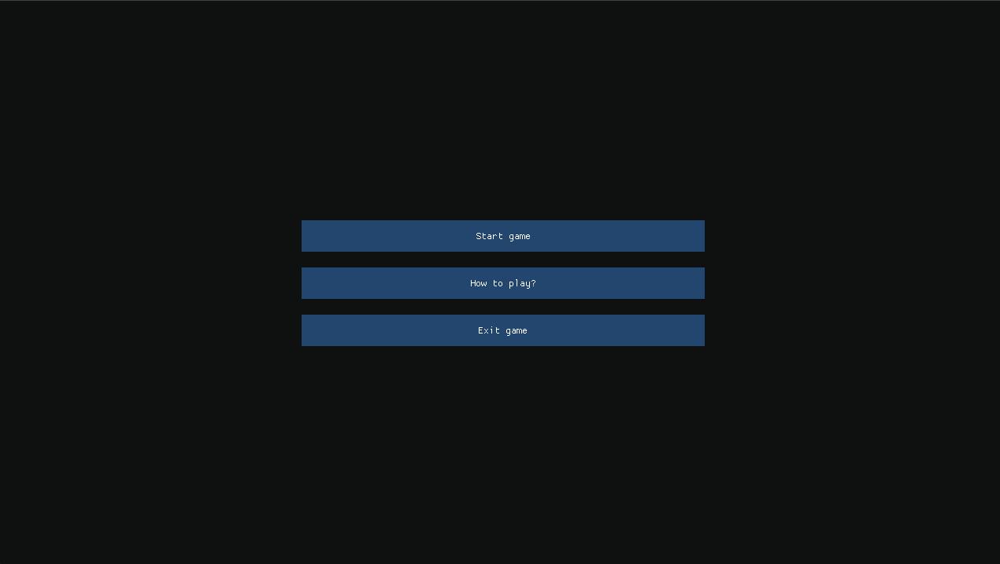
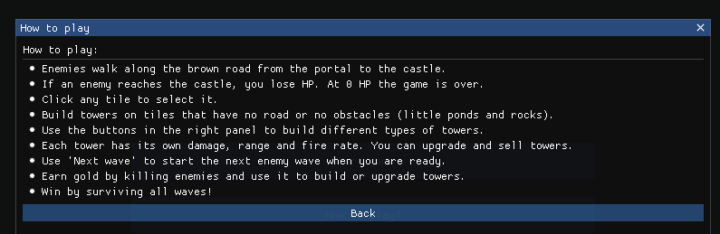
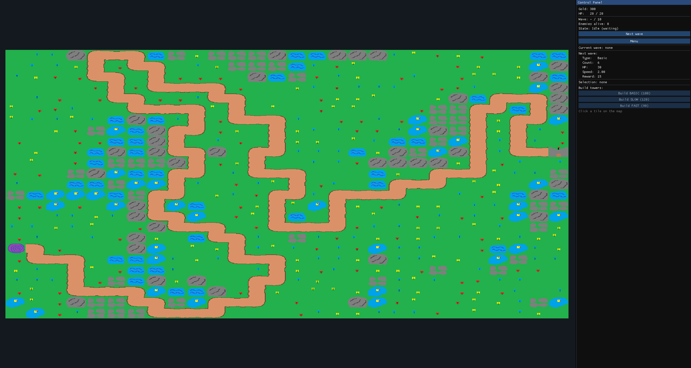
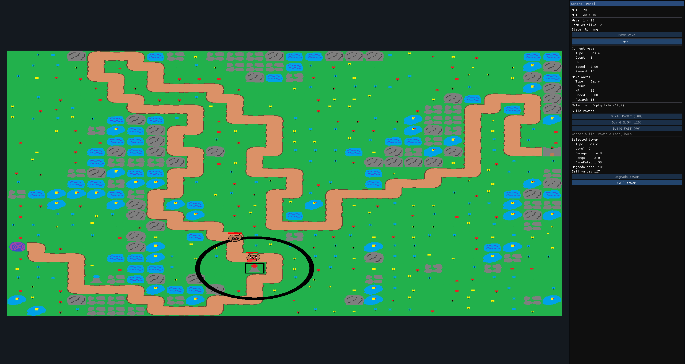
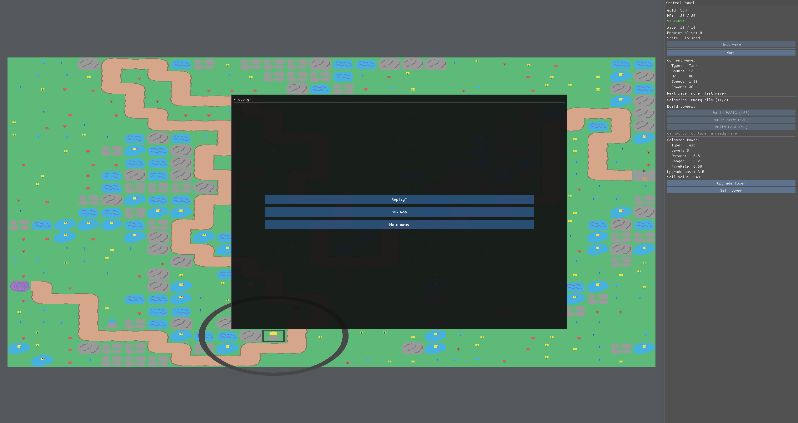

# Tile Defense - Procedural OpenGL Tower Defense

**Tile Defense** is a 2D Tower Defense game written in C++ using OpenGL 3.3.  
The project focuses on procedural map generation, real-time rendering and basic gameplay systems such as enemy waves, tower building, tower upgrades and projectiles.

The game was created as part of an engineering thesis project.

---

## Screenshots

<table>
  <tr>
    <td align="center"><strong>Main menu</strong></td>
    <td align="center"><strong>How to play</strong></td>
  </tr>
  <tr>
    <td></td>
    <td></td>
  </tr>
  <tr>
    <td align="center"><strong>Gameplay start</strong></td>
    <td align="center"><strong>Gameplay wave</strong></td>
  </tr>
  <tr>
    <td></td>
    <td></td>
  </tr>
</table>

<p align="center">
  <strong>Victory screen</strong>
</p>

<p align="center">
  
</p>

---

## Main Features

- 2D Tower Defense gameplay
- Procedurally generated enemy path
- Terrain and obstacle generation based on Perlin noise
- Grid-based map system
- Three tower types:
  - Basic Tower
  - Slow Tower
  - Fast Tower
- Enemy wave system
- Tower upgrades and selling
- Projectile system
- Win and lose conditions
- In-game menu and "How to play" window
- Texture-based rendering using OpenGL
- User interface created with Dear ImGui

---

## Gameplay Overview

The player defends the goal point from waves of enemies moving along a generated path.  
Enemies start from the portal and follow the road towards the target. If an enemy reaches the goal, the player loses HP. The game ends when the player's HP reaches zero or when all enemy waves are completed.

The player can:

- select tiles on the map,
- build towers on valid empty tiles,
- upgrade existing towers,
- sell towers to recover part of the invested gold,
- start the next enemy wave manually,
- generate a new map during a new attempt.

Each tower type has different parameters such as damage, range and fire rate. The player earns gold by defeating enemies and uses it to build or upgrade defenses.

---

## Procedural Map Generation

The main technical focus of the project is procedural generation.

The enemy path is generated automatically as a sequence of connected grid cells. The map generation logic ensures that the path is valid and traversable, so enemies can always move from the starting point to the goal.

The surrounding terrain and obstacles are generated using Perlin noise. This allows the game to create different map layouts between runs without manually designing every level.

This approach improves replayability and makes the map generation system an important part of the gameplay.

---

## Rendering

The game uses OpenGL 3.3 Core Profile for rendering.

The map is rendered as an instanced grid. Each tile is drawn based on its type: background, road, start/goal field or obstacle. The project uses texture atlases for tiles, enemies and towers.

Dynamic objects such as enemies, towers and projectiles are rendered separately. The user interface is created with Dear ImGui and displayed as an overlay on top of the game scene.

GLSL shader source code is embedded directly in `main.cpp` and compiled at runtime using the helper `Shader` class.

---

## Technologies

The project uses:

- C++
- OpenGL 3.3 Core Profile
- GLFW
- GLAD
- Dear ImGui
- stb_image
- GLSL
- Microsoft Visual Studio / Visual Studio Code

---

## Project Structure

```text
TileDefense-Procedural-OpenGL/
│
├── TowerDefense.sln
├── README.md
├── .gitignore
│
├── docs/
│   └── Praca_inzynierska_Jakub_Michalski.pdf
│
├── screenshots/
│   ├── main_menu.png
│   ├── how_to_play.png
│   ├── gameplay_start.png
│   └── gameplay_wave.png
│   └── victory.png
│
└── TowerDefense/
    ├── main.cpp
    ├── Shader.cpp / Shader.h
    ├── Grid.cpp / Grid.h
    ├── GameState.cpp / GameState.h
    ├── GameTypes.cpp / GameTypes.h
    ├── Enemy.cpp / Enemy.h
    ├── Tower.cpp / Tower.h
    ├── WaveConfig.cpp / WaveConfig.h
    ├── WaveSystem.cpp / WaveSystem.h
    ├── ProjectileSystem.cpp / ProjectileSystem.h
    ├── stb_image.h
    ├── TowerDefense.vcxproj
    ├── TowerDefense.vcxproj.filters
    └── assets/
```

---

## Controls

The game is controlled mainly with the mouse.

Basic controls:

- Click a tile to select it.
- Build towers using the control panel.
- Select an existing tower to upgrade or sell it.
- Press `Next wave` to start the next enemy wave.
- Use the in-game menu to pause, restart, generate a new map or return to the main menu.

---

## How to Build

The project was created for Windows and Visual Studio.

### Requirements

- Windows 10 or Windows 11
- Visual Studio 2022 or newer
- Graphics card supporting OpenGL 3.3
- GLFW
- GLAD
- Dear ImGui

### Build Steps

1. Clone the repository:

```bash
git clone https://github.com/Jukir2/TileDefense-Procedural-OpenGL.git
```

2. Open the solution file in Visual Studio:

```text
TowerDefense.sln
```

3. Select build configuration:

```text
Release | x64
```

4. Build and run the project.

---

## Documentation

The full engineering thesis is available in the `docs` folder:

```text
docs/Praca_inzynierska_Jakub_Michalski.pdf
```

It describes the project architecture, procedural generation, rendering, gameplay systems, user guide and manual tests.

---

## Current Limitations

The current version does not include:

- sound system,
- saving and loading game state,
- persistent progression between runs,
- difficulty level selection,
- saving generated maps or loading maps from a seed.

These features can be added in future versions.

---

## Future Development Ideas

Possible improvements:

- adding sound effects and music,
- adding more tower and enemy types,
- saving and loading game progress,
- adding selectable difficulty levels,
- saving generated maps by seed,
- improving UI visuals,
- adding animations and visual effects,
- moving shader code into separate GLSL files.

---

## Author

Jakub Michalski

---

## License

This project is intended for educational and portfolio purposes.
